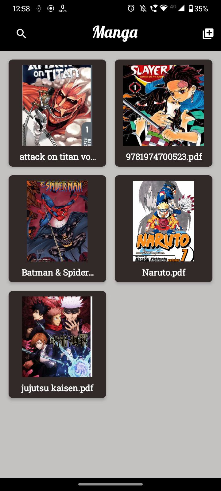
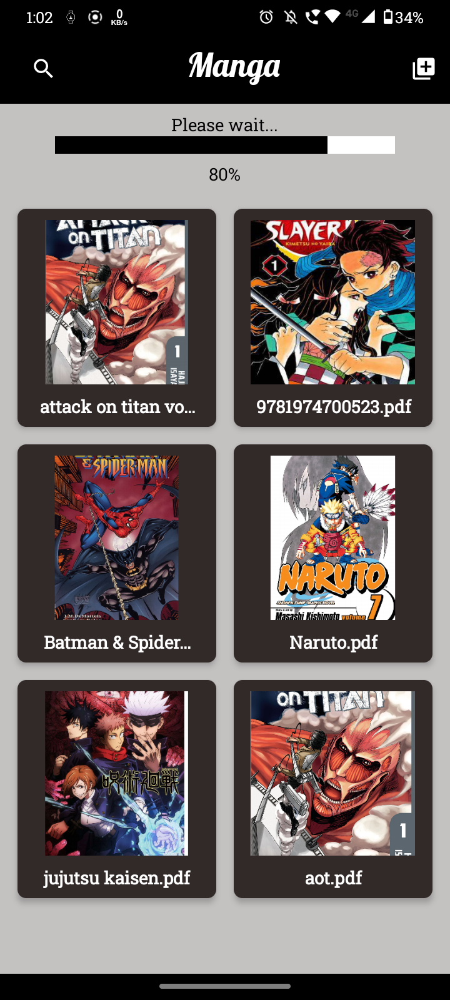
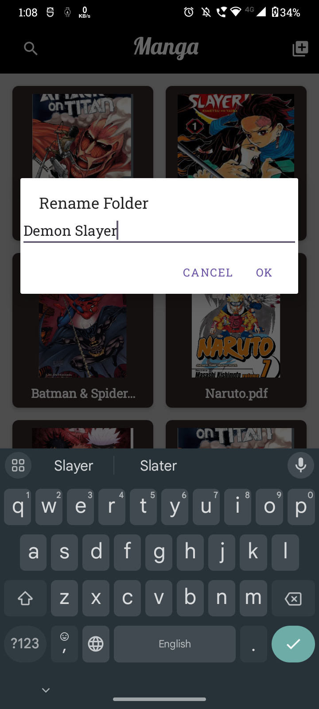
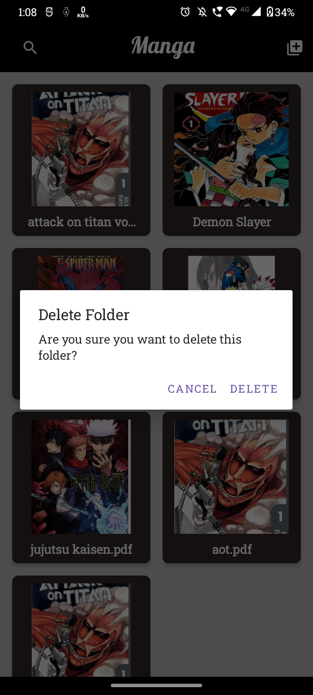
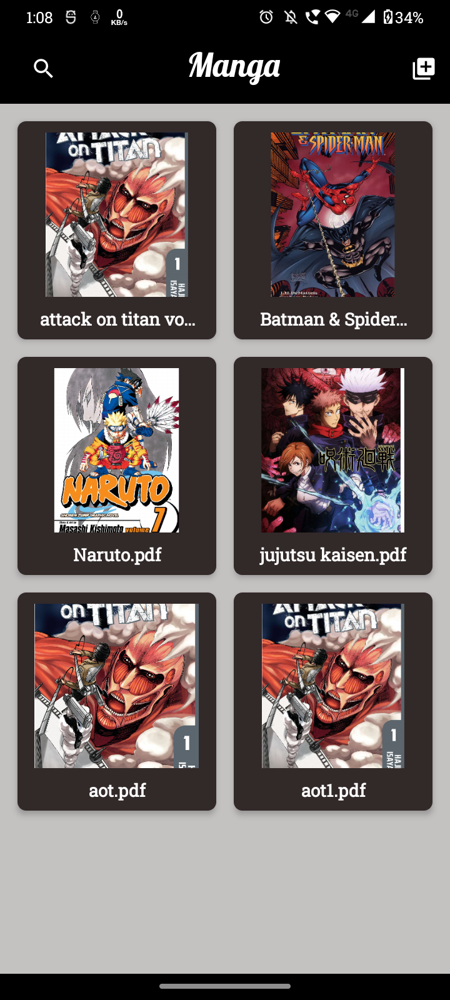

# Manga Manager

Manga Manager is an Android application designed to enhance the manga reading experience for enthusiasts. The app allows users to select manga PDFs from their devices and read them in the traditional manga format, from right to left.

## Features

- **PDF Manga Reader:** Read manga PDFs on your Android device.
- **Traditional Manga Format:** View manga in the traditional right-to-left format.
- **Reading Progress:** The app remembers your reading progress. Resume from where you left off when you reopen the manga.
- **Full-Screen Reading:** Enjoy a full-screen reading experience for immersive manga reading.

## Screenshots

<!-- Grid layout for screenshots -->

    
    
    
    
    
    
    
    

## Installation

Currently, Manga Manager is under development and not yet available for general download.

## Usage

1. **Select Manga:** Choose a manga PDF from your device.
2. **Read Manga:** Navigate through pages in the traditional manga reading style.
3. **Resume Reading:** Close the app and reopen to resume from where you left off.
4. **Full-Screen Mode:** Toggle full-screen mode for an immersive reading experience.

## Development

Manga Manager is developed for Android using Java/Kotlin and Android Studio.

## Contributing

Contributions are welcome! Fork the repository and submit a pull request.

## License

This project is licensed under the MIT License. See [LICENSE](LICENSE) for details.
